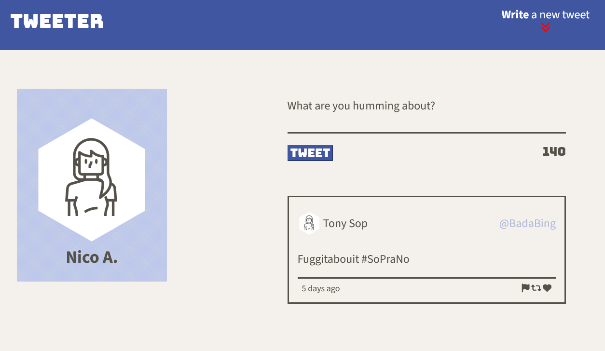
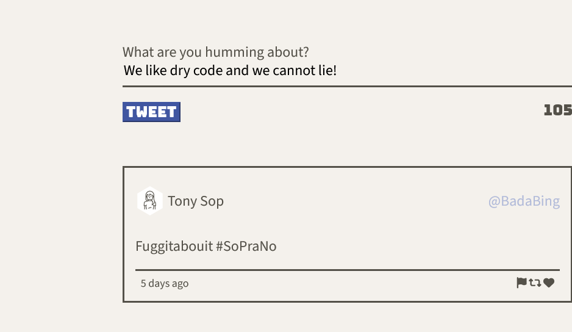
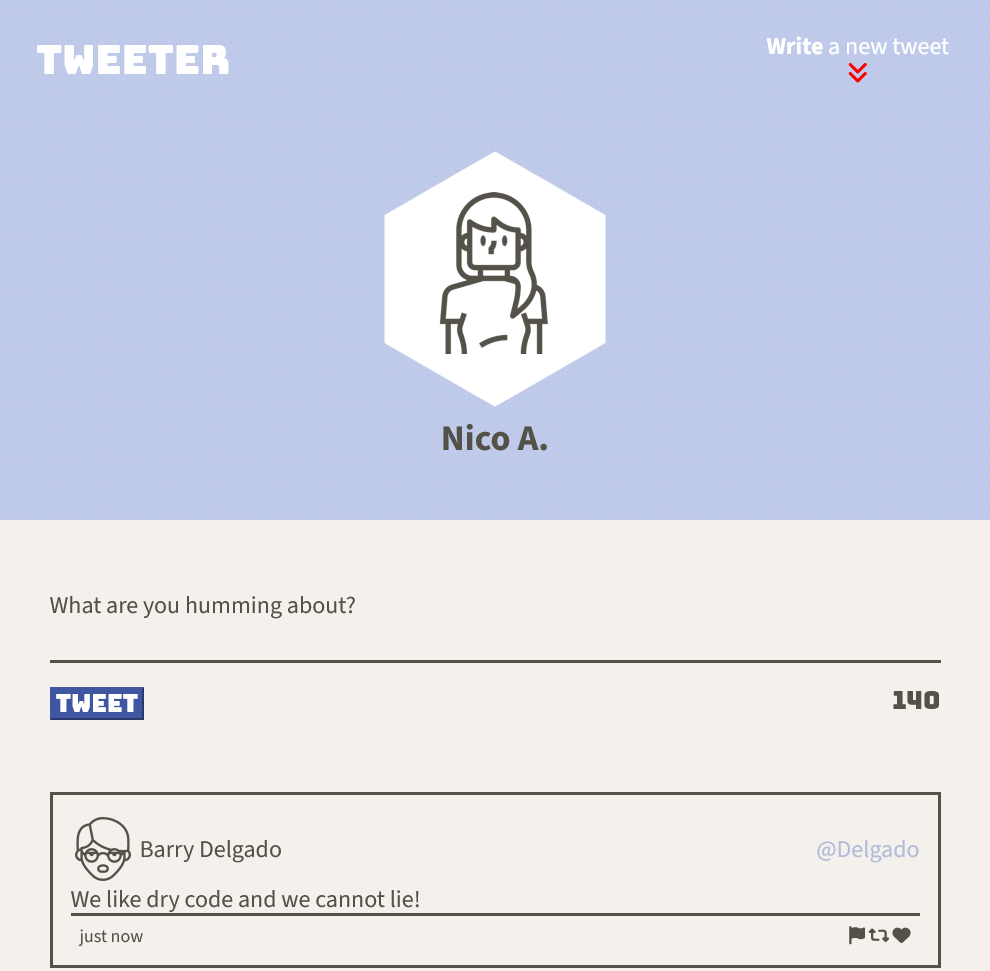
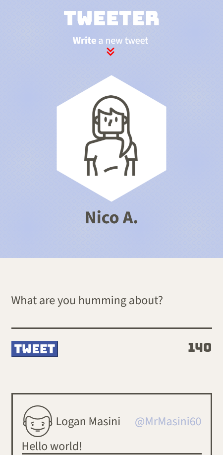

# Tweeter Project

Tweeter is a simple, single-page Twitter clone.

You can create your own tweets and see them in real time! The app is responsive per device and updates in real time. Not only that, but hover over some boxes, arrows, and icons to see some css magic! You wont need any social media after Tweeter!

## Dependencies

- Express
- Node 5.10.x or above
- A want to have fun! (2.0.1 or above)

## Getting Started

1. Clone the following repository onto your local device
` git clone git@github.com:nicoayamen/tweeter.git `

3. Install dependencies using the `npm install` command.

3. To Start the web server use the ` npm start ` command.

4. Go to <http://localhost:8080/> in your browser.

5. Let the world know your thoughts!

## Final Product 

## Special Thanks

- A huge thank you to Kim O'Dell who helped me when my computer broke and I lost all my progess last week.
- A big thank you to the Lighthouse Mentors for showing me the silliness in my thought process at times.